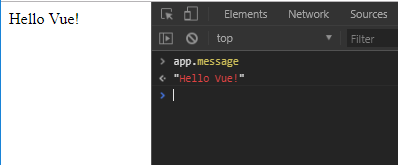
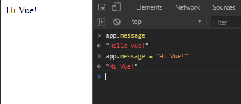
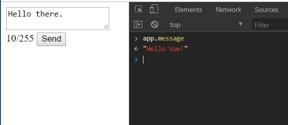
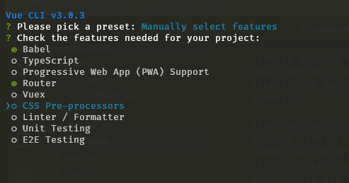

<div>
<style>
  figure {
    display: flex;
    flex-wrap: wrap;
  }

  figure > :not(figcaption) {
    margin: 20px !important;
  }

  figcaption {
    width: 100%;
    flex: 0 0 auto;
  }

  div.sourceCode {
    background: #eee;
    padding: 10px;
  }

  figure, img, code {
    page-break-inside: avoid;
  }
</style>
</div>

Vue is one of the cool new kids on the block in JavaScript land. Of course, you hear about new frameworks every week, but few of them garner as much traction. Vue is one of the most popular projects on github, and surveys show very high developer satisfaction.

## Goals


## What is Vue solving?

Vue is a front-end framework for developing web applications. What does this mean? What problems does it solve and what makes it worth using?

Vue.js helps you build interactive web applications, by providing you a more powerful and easier to use toolset than the standard browser APIs. Its _reactive_ system makes it easy to manage data, application and ui state, its components system makes it easy to reuse and compose code within and between projects and the templating system is also much easier to use than manipulating the DOM directly. But the main reason to choose for a framework like VueJS aren't these conveniences, but rather for giving your team a shared _framework_.

There is real value in following conventions and staying consistent within and across projects, and this becomes more true the bigger the team gets, the more code there is and the more people join and leave. Having a solution that everyone agrees with, understands and could maintain quickly becomes more important than using the best tool for the job. This is where frameworks shine, and where their value lies compared to self-built solutions or using separate libraries.


## Code conventions

I've tried to keep the code examples in this workbook consistent in style. Most of the used conventions can be enumerated in a list:

* Two spaces for indenting
* Close each statement with a semi-colon
* camelCase variables and properties, PascalCase classes, kebab-case file names


This workbook also uses ES5 and ES6 features extensively. If you are comfortable with lambda functions, destructuring and the likes, feel free to continue to the next section. If these words are foreign to you however, we will review the most important features here. Please take the time to get a good grip on these concepts, as they are the foundation for the rest of this workbook -- and modern front-end development in general.

### Variable declarations

The brand new `let` and `const` keywords in JavaScript let you declare variables, just like `var`. The main difference is that variables declared with the new keywords have stricter scoping rules, that are more consistent with other main stream programming languages. Specifically, variable declarations aren't 'hoisted' anymore, and are block scoped instead of function scoped. In this workbook, the convention is to use `const` where it makes sense, `let` when needed and `var` never.

### Object literal syntax

Several improvements to the object literal syntax have been introduced, and we will use two of them extensively: Object Methods and XXX. Below follow examples of both, with the new syntax on the left, and the identical object in ES5 syntax to the right. The left and right code samples do exactly the same thing, but the new syntax is much more compact. 

<figure markdown>

```js
const myObject = {
  someMethod() {
    // method body goes here
  }
};
```

```js
const myObject = {
  someMethod: function() {
    // method body goes here
  }
};
```

  <figcaption>The new syntax leaves out the function keyword, saving you a bit of typing</figcaption>
</figure>

<figure markdown>

```js
const someThing = "hi";
const myObject = { someThing };
```

```js
const someThing = "hi";
const myObject = {
  someThing: someThing
};
```

  <figcaption>If you want to set a property on an object with the same name as a variable, you don't have to repeat it. This syntax is used quite a lot in Vue.</figcaption>
</figure>

### Template strings

As in many programming languages, js allows you to write string literals either with `'single quotes'` or `"double quotes"`. ES6 adds backtics to the mix, with two important conveniences:

```js
let expression = "javascript expressions"
let myString = `backticks can have ${expression} embedded in them`;
let myLongString = `
They
also
allow
for
new lines
in the string
`;
```

Throughout this tutorial, we will use double quotes for strings most of the times, single quotes when we need strings in html attributes (e.g. ``), and backticks when we specifically want to use their new functionality.

### Lambda functions

    TODO

### Destructuring

    TODO

### Modules

    TODO

### Final remarks

There are a lot more new features that we haven't touched, but these are the items that we will use extensively. The 'evergreen' browsers support most of these features out of the box, and later, we will see how to set up your project so that you can use almost any cutting edge feature while supporting older browsers too.

## Exercises

    TODO: A few instructions on how to run the exercises

## First Experience

One appealing feature of Vue is their focus on 'scalability'. This word has many meanings, but here it means that Vue can be made suitable for the biggest complex projects and the smallest quick one-offs. Our first example will be on the simple end of this spectrum. All you need to do to start using Vue, is include one javascript file. You can get this from the official website, but to make things easier, it is also hosted at a public CDN, which you can just link to.

Once you have this in place, you can create a new _Vue instance_ with `new Vue()`. The options you pass here tell Vue what to do. You can point it to a DOM node where your Vue application will be rendered, give it a template, hook into life cycle events and more.

Lets look at the first example of the Vue documentation page and deconstruct it together:

```html
<!DOCTYPE html>
<html>
<head>
  <title>My first Vue app</title>
  <script src="https://unpkg.com/vue"></script>
</head>
<body>
  <div id="app">
    {{ message }}
  </div>

  <script>
    const app = new Vue({
      el: "#app",
      data: {
        message: "Hello Vue!"
      }
    });
  </script>
</body>
</html>
```

You can find this example in the exercises in `exercices/02-simple-app/index.html`, and you can run it just by opening it with your browser. Lets look closer at what is happening in this example.

```html
  <script src="https://unpkg.com/vue"></script>
```

Loads the latest version of vue into our page. [unpkg](https://unpkg.com/) is a cdn that serves any library or package from npm as a plain javascript file. There are some downsides to this, but it is ideal for small projects and experimentation.

```html
  <div id="app">
    {{ message }}
  </div>
```

This is where we describe what vue should render for us. We have a container element with an id, so we can easily pass it to the Vue constructor later, and inside it a template for Vue to render. This minimal example uses `{{ }}` to render a javascript expression. Vue templates can do a lot more for you, and you can even choose to use other templating languages if you prefer. We will see a lot more of this soon.

```js
    const app = new Vue({
      el: "#app",
      data: {
        message: "Hello Vue!"
      }
    });
```

To conclude this example, we create the Vue instance that we keep talking about. We give it two options: `el` is a _css selector_ that points to the container element we just looked at, and `data` contains all the data that we want Vue to keep track of and make available in the template. In this case, we just have one data property, `message`, which we use in the template. This reveals an important concept in Vue: there are specific ways to provide data to your template, the `data` property being the main one. To illustrate this point, if you instead had written

```js
    const message = "Hello Vue!";

    const app = new Vue({
      el: "#app",
      data: { }
    });
```

Vue doesn't understand you want to use that variable insider your template. As a result, the application would not render correctly, and you would see an error message in your dev tools console saying something like "vue.js:597 [Vue warn]: Property or method "message" is not defined on the instance but referenced during render.".

Before we expand on this example, lets look at one more detail hiding behind that `data` property. If you open up the application (without the mistake) and open the dev tools console, you can check out what is in our `app`. You'll find that `message` now is a property of the Vue instance. What's more is, you can actually change it's value and the template will be updated immediately to reflect the change! One of Vue's core systems is it's reactivity system. Vue will _watch_ everything you define in the `data` property, keeps track of where you use those properties, and runs updates when it detects a change. The reactivity system is really important, but may also seem a little bit magical. We will take a deeper look into how things work under the hood. This will help you leverage reactivity, and show you some of the pitfals to avoid.

<figure>
  
  
  <figcaption markdown>We can access the `message` data property in the console, and even update it.</figcaption>
</figure>

### More features

In the next section we will gradually expand on the example we started with, to look at some of the other features Vue provides. Lets say we are building a twitter client, and we want the user to write a message themselves, and send it if `message.length > 0` and `message.length < 255`. The first thing we can do is to expand on our template. Based on what we have seen already, we could write something like:

```html
  <div id="app">
    <form method="POST" action="/messages">
      <label for="message-input">Message:</label>
      <textarea id="message-input" name="message">{{ message }}</textarea>
      <footer>
        <span>{{ message.length }}/255</span>
        <button type="submit">Send</button>
      </footer>
    </form>
  </div>
```

This will correctly display the message we set in the `data` property, and show the correct length. But it starts to break down when you try to edit the message &emdash; the length doesn't change. What's going on? If Vue is so reactive, shouldn't it be able to detect this change for you? The problem is how we render the message. We used `{{ message }}`, but these curly braces can only be used to display data, not to make it interactive. When you edit the text in the textarea, it doesn't actually change the value of `message`.

<figure>
  
  <figcaption>Editing the text in the textarea does not automatically change the value of `message`</figcaption>
</figure>


#### Directives

To fix this, we could hook into `onchange` or `oninput` events, update the `data.message` property ourselves and have Vue rerender the template, but this pattern is so common that Vue has a built-in solution for this. Vue lets you augument elements in your template using _directives_, a concept introduced by AngularJS. Vue provides several directives such as `v-if` and `v-for`, which you can add as HTML attributes to manipulate the behavior of an element. The one that we want to use here is the `v-model` attribute:

```html
      <textarea id="message-input" name="message" v-model="message"></textarea>
```

This creates a two-way binding between the `data.message` property and the value of the textarea element. Now, when we type in the textarea, Vue will automatically update the value of `data.message` and then update the character counter in the template.

Next, let's work on preventing the user to send the message when it isn't valid. HTML already has a way to disable ui elemnts, through the `disabled` attributes, and it would be nice if we could leverage that. In other words, when the value of `data.message` is a valid message, we want to render `<button type="submit" disabled="false">` and render `<button type="submit" disabled="true">` when the value is invalid. One way we can achieve this is with the `v-if` directive we just mentioned:

```html
  <button v-if="message.length == 0 || message.length > 255" type="submit" disabled="true">Send</button>
  <button v-else type="submit" disabled="false">Send</button>
```

This works, but is a bit clunky. And with more states or attributes, this will only become worse. What we really want is to dynamically set the value of the attribute. You might try `<button type="submit" disabled="{{ ... }}">`, but this won't work; Vue doesn't pick up double brace expressions in HTML attributes. Instead, Vue provides you with the `v-bind` directive, which you can use as follows:

```html
  <button type="submit" v-bind:disabled="message.length == 0 || message.length > 255">Send</button>
```

This shows that there are actually multiple ways to provide arguments to a directive: the `v-bind` directive takes an attribute name that you want to bind to, and a JavaScript expression as its value. Later we'll also see directives that take _modifiers_. Binding expressions to attributes is so common, that Vue allows you to abbreviate `v-bind:` to just `:`, so we can write `<button :disabled="...">` instead.

#### Computed

Next, we will render a warning when the message is invalid. This makes the interface much clearer for users _and_ it forces us to adress a problem in our template. We could show/hide the warning with `v-if`, and just copy the expression we bound to the `disabled` attribute for our button. But if we're honest, it already doesn't feel great to write such a long expression in our template. Copy-pasting it would make our template much worse.

Enter the `computed` property. With `computed`, you can provide your application with information that is derived from other information. For example, instead of writing `message.length == 0 || message.length > 255` directly in our template, we can create a computed property `isInvalid`:

```js
    const app = new Vue({
      el: "#app",
      data: {
        message: "Hello Vue!"
      },
      computed: {
        isInvalid() {
          return this.message.length == 0 || this.message.length > 255;
        }
      }
    });
```

And then use it in our template like so:

```html
  <footer>
    <p v-if="isInvalid" class="warning-message">
      The current message is either too long or too short.
    </p>

    <span>{{ message.length }}/255</span>
    <button type="submit" :disabled="isInvalid">Send</button>
  </footer>
```

Computed properties are really useful. They are reactive, make your templates clearer, help organize your code, make it easier to write automated tests, and are very efficient to boot. Vue does a good job of detecting data dependencies, so a computed property is only recomputed when neccesary. In our case, `isInvalid` will be updated when the value of `data.message` changes. But if we had another data property, say `data.username`, we could change it all day without triggering a recalculation of `isInvalid`. The only constraints on computed properties, is that they are _read-only_, and that they should be _pure functions_.

#### Methods and events

Before we close this section off, there are two more major features we should look at: methods and events. Just like `computed` and `data`, you can provide a `methods` property to the Vue constructor, making its contents available to your template and the rest of your Vue application. But instead of (computed) data, you are now providing methods, which you can call from your template. An example usecase is formatting monetary values. Lets say your app has several data properties containing money and you store them internally as integers. You could then use a method to present those integers as correctly formatted strings.

<figure markdown>

```js
  const app = new Vue({
    data: {
      price: 11200 // 112 dollar and 00 cents.
    },
    methods: {
      formatMoney(cents) {
        const dollars = Math.floor(cents);
        let remainingCents = cents % 100;
        remainingCents = remainingCents.toString().padEnd(2, "0");

        return `$ ${dollars}.${remainingCents}`;
      }
    }
  });
```

```html
  <span>{{ formatMoney(price) }}</span>
```

</figure>

The most common usecase for methods though, is to handle events. In almost any application, you will want to listen to DOM events. Maybe you want to react to users clicking an element or moving their mouse, or maybe you want to run some custom behavior when an input is changed, or a form is submitted. Vue lets you do this declaratively with the `v-on` directive. Its full syntax is `v-on:eventname.modifier="expression or method"`. For example, we can add a button to our example to clear the form like so:

```html
  <button type="button" v-on:click="message = ''">Clear</button>
```

In this case, we add an event listener for the `click` event, and set `message` to an empty string when it is triggered. Usually though, you pass the name of a method, which will run when the event is triggered. We could for example catch the `submit` event on the form, and send a POST request ourselves. This way, we can prevent the page from reloading, which creates a nicer user experience. We just have to add the event handler to our template:

```html
  <form v-on:submit="handleSubmit">
```

And then create a method for it:

```js
  const app = new Vue({
    /* ... */
    methods: {
      handleSubmit(event) {
        event.preventDefault(); // This prevents the page reload

        // You could use XmlHttpRequest, the Fetch API or a library like axios to send the data.
        window.fetch("/messages", { method: "POST" })
          .then(response => {
            // The POST was succesful, so we can reset the form.
            this.message = "";
          });
      }
    }
  });
```

As with `v-bind`, Vue provides some shortcuts to make your templates and event handlers a little more concise. Instead of `v-on:submit` you can write `@submit`. Vue also defines _modifiers_ that help you keep your event handlers clean. In our example, instead of having the `event.preventDefault();` in the handler, we could write `@submit.prevent="handleSubmit"` in the template. Vue provides dozens more of these modifiers, which are especially great for keyboard events. Writing `@keyup.ctrl.shift.s="saveAll"` saves you a lot of keyboard event checking code in the event handler, and makes your code more declarative too.

### Conclusion

  TODO

## A broader look

Earlier we said that Vue scales well to different project sizes. We have seen how we can use Vue in a very small project, and looked at some of the core functionalities that Vue delivers out of the box. We will now take a step back, to look at the ecosystem around Vue, and how we would go about using Vue in more realistic scenarios.

There are several things that you will usually need to deal with as your application grows in size, such as routing, project structure, state management and testing. This is where you can best tell the difference between a library and framerwork. Where frameworks like Angular solve several of these out of the box, a library like React leaves you to your own devices, or to community-provided solutions. Vue chooses a middle road: there are official solutions to state management, routing and testing, in the form of `Vuex`, `Vue Router` and `vue-test-utils`, but they are packaged separately. They are developed by the _core Vue team_, which maintains the official ecosystem around Vue. This also includes a chrome devtools extension, serverside rendering support, a static site generator, and support for typescript, webpack, rollup and other toolchains. 

Having official solutions for these is _great_. It saves you a lot of time figuring out build pipelines, gives you the confidence that things will work well together, and the documentation for these official packages is (un)usually great. Besides these official projects, there is also an active and growing community scene around Vue.

### Gearing up

So lets see how we would set up Vue for a bigger project, using the Vue CLI. First, you need to make sure you have Node and NPM installed on your machine. Then you will want to install the CLI tool, by running `npm install -g @vue/cli`. When this is done, you are ready to set up a new Vue project. Navigate to the folder where you want to set up your project (which will have it's own directory) and then run `vue create project-name`. The CLI will create the folder for you, and then asks you questions on how you want to set your project up. The first prompt asks if you want to choose a predefined template, or if you want to manually select features. If you go for the last option, you get to choose from a whole list of features, including Typescript and css preprocessor support. Depending on which features you choose here, you may be prompted to make more specific choices: which css preprocessor? Which linter settings?



For now, lets just choose the Babel and Router options. Before we are done, the CLI asks if we want to use 'history mode' for the router (no), where we want to store these settings (in a separate file) and if we want to save this configuration as a preset for the next time you create a Vue project (no). The Vue CLI then starts generating a boilerplate application structure and installs the neccesary dependencies. When it is done installing, the result is a modern, fully featured front-end development environment. Before we will dive into


It comes with a few npm scripts, most importantly a `build` script and a `serve` script. Running the last one (`npm run serve`) starts a Webpack development server with hot reloading.

H