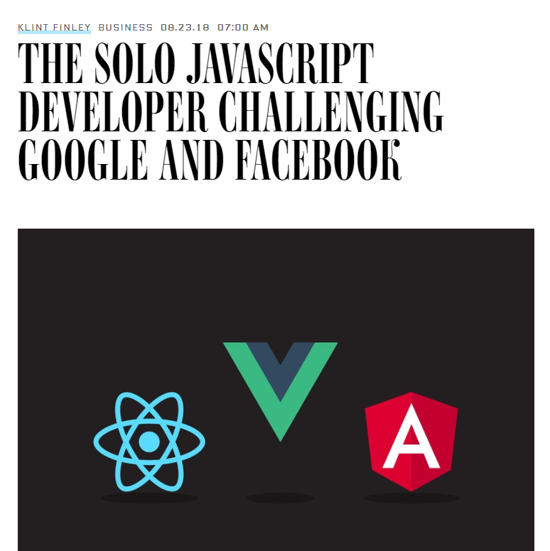
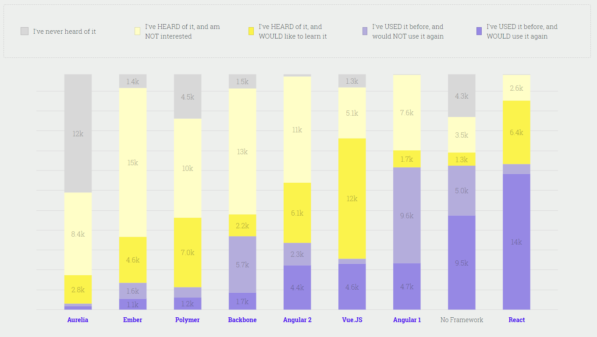
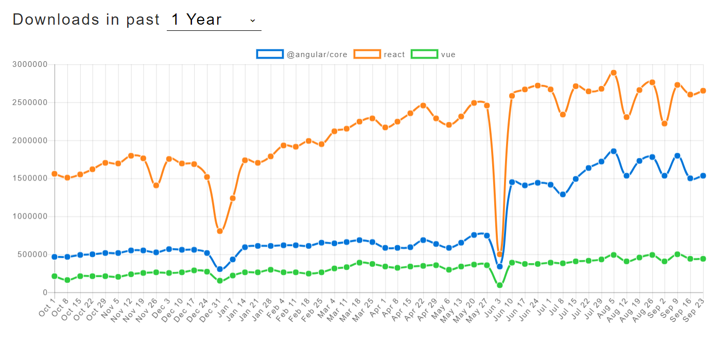
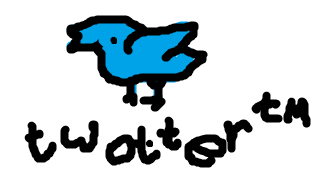

<div>
<style>
* { margin: 0; padding: 0; box-sizing: border-box; }

body {
  overflow: hidden;
}

header {
  display: none;
}

.slide-container {
  height: 100vh;
  overflow: auto;
  
  scroll-snap-type: block;
}

.slide {
  width: 100vw;
  height: 100vh;
  scroll-snap-align: start;
  padding: 10vmin;
  background: #efefef;
}

code:not(.sourceCode),
div.sourceCode {
  background: #fff;
  padding: 0.1em 1em;
}
div.sourceCode { padding: 1em; }

aside {
  break-inside: avoid;
}

h2, h3 {
  margin: 1em 0 1.5em;
  text-align: center;
}

h4 {
  text-align: center;
}

img {
  max-width: 90%;
  max-height: 90%;
  display: block;
  margin: auto;
}
</style>
</div>

<main id="main" class="slide-container" markdown>

<section class="slide" markdown>
## Roll Call

Who's attending today?

* JS skill level
* ES6 experience
* React? Angular? Redux? something else?

</section>
<section class="slide" markdown>

## About me

* Started with cherrypicked.io 🍒
* Lead a transition of AngularJS => VueJS
* Really enjoy the Vue community
* Contributed to the Vue CLI

</section>

<section class="slide">
  
</section>

<section class="slide" markdown>


## Why are we here?

Vue 💯

</section>

<section class="slide">
  
</section>

<section class="slide">
  
</section>

<section class="slide">
  
</section>

<section class="slide">
  
</section>

<section class="slide" markdown>

## ES6

<p style="text-align: center; font-size: 40px">👌 🙅 🤷</p>

</section>
<section class="slide" markdown>

### Variable declaration

* <span style="display: inline-block; width: 1.4em;">🙅</span> `​      name = "Ken";`
* <span style="display: inline-block; width: 1.4em;">🙅</span> `var   name = "Ken";`
* <span style="display: inline-block; width: 1.4em;">👌</span> `let   name = "Ken";`
* <span style="display: inline-block; width: 1.4em;">👌</span> `const name = "Ken";`

</section>
<section class="slide" markdown>

### Object Literals

<div class="two-col" style="columns: 2">
<aside markdown>

#### 🤷

```js

const me = {
  wave: function() {
    console.log("👋");
  }
};

```

</aside>
<aside markdown>

#### 👌

```js

const me = {
  wave() { console.log("👋"); }
};

```

</aside>
</div>

</section>


<section class="slide" markdown>

### Object Literals

<div class="two-col" style="columns: 2">
<aside markdown>

#### 🙅‍

```js

const name = "Ken Voskuil";

const me = {
  name: name
};

```

</aside>
<aside markdown>

#### 👌

```js

const name = "Ken Voskuil";

const me = { name };

```

</aside>
</div>

</section>


<section class="slide" markdown>

### Lambdas

<div class="two-col" style="columns: 2">
<aside markdown>

#### 🤷

```js

function add(a, b) {
  return a + b;
}

```

</aside>
<aside markdown>

#### 👌

```js

const add = (a, b) => a + b;

```

</aside>
</div>

</section>


<section class="slide" markdown>

### Lambdas

<div class="two-col" style="columns: 2">
<aside markdown>

#### 🙅🙅🙅🙅🙅

```js

let self = this;

setTimeout(function() {
  self.wave();
}, 1000);

// OR


setTimeout((function() {
  self.wave();
}).bind(this), 1000);

```

</aside>
<aside markdown>

#### 👌

```js

setTimeout(() => self.wave(), 1000);

```

</aside>
</div>

</section>


<section class="slide" markdown>

### Lambdas

<div class="two-col" style="columns: 2">
<aside markdown>

#### ⚠️⚠️⚠️⚠️⚠️

```js

let me = {
  name: "Ken Voskuil",
  sayName: () => {
    console.log(this.name);
  }
}

```

</aside>
<aside markdown>

#### 👌

```js

let me = {
  name: "Ken Voskuil",
  sayName() {
    console.log(this.name);
  }
}

```

</aside>
</div>

</section>
</section>


<section class="slide" markdown>

### Destructuring

<div class="two-col" style="columns: 2">
<aside markdown>

#### 🤷

```js

const name = person.name;
const age = person.age;
const jobTitle = person.jobTitle;

```

</aside>
<aside markdown>

#### 👌

```js

const { name, age, jobTitle } = person;

```

</aside>
</div>

</section>


<section class="slide" markdown>

## Example time

```html
<!DOCTYPE html>
<html>
<head>
  <title>My first Vue app</title>
  <script src="https://unpkg.com/vue"></script>
</head>
<body>
  <div id="app">
    {{ message }}
  </div>

  <script>
    const app = new Vue({
      el: "#app",
      data: {
        message: "Hello Vue!"
      }
    });
  </script>
</body>
</html>
```

</section>


<section class="slide" markdown>

## Example time



</section>


<section class="slide" markdown>

## Components

```js

const PaintingSummary = {
  props: [ 'painting' ],
  template: `
  `,
  data() {
    return { };
  },
  computed: {

  },
  methods: {
    
  }
};

```

</section>


<section class="slide" markdown>

## Components

```js

const app = new Vue({
  components: { PaintingSummary },
  template: `
  ...
  <painting-summary :painting="painting" />
  ...
  `
})

```

</section>


<section class="slide" markdown>

## Components

```js


```

</section>

<script>

const container = document.getElementById("main");

const prev = () => container.scrollTop = Math.round(container.scrollTop/window.innerHeight - 1)*window.innerHeight;
const next = () => container.scrollTop = Math.round(container.scrollTop/window.innerHeight + 1)*window.innerHeight;

window.addEventListener("keydown", e => {
  switch (e.key) {
    case "ArrowUp":
    case "ArrowLeft": prev(); e.preventDefault(); break;

    case "ArrowDown":
    case "ArrowRight": next(); e.preventDefault(); break;

    case " ":
      e.shiftKey ? prev() : next();
      e.preventDefault();
      break;
  }
});
</script>

</main>